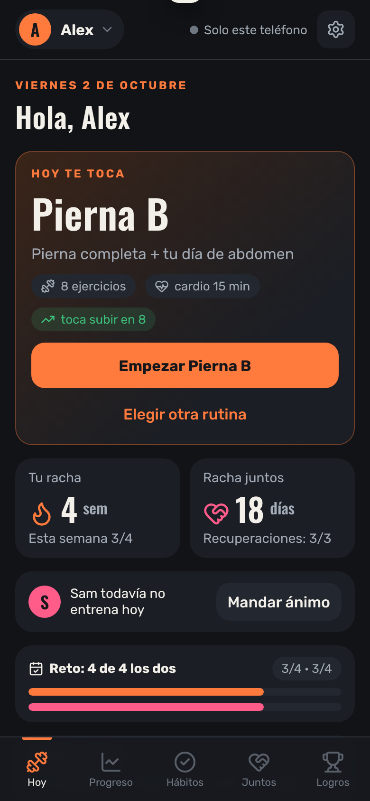
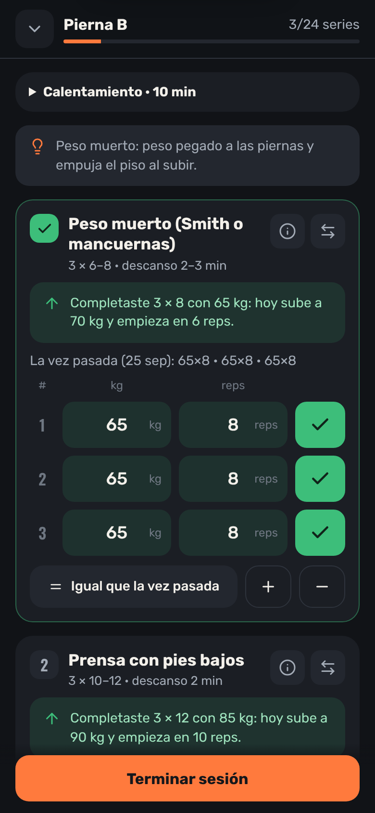
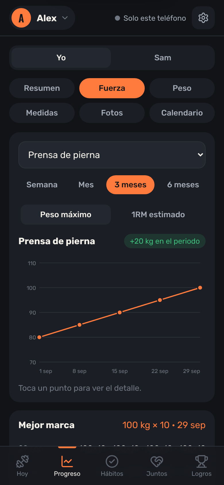
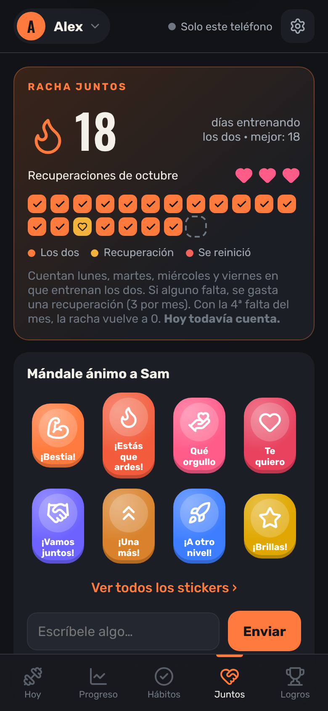
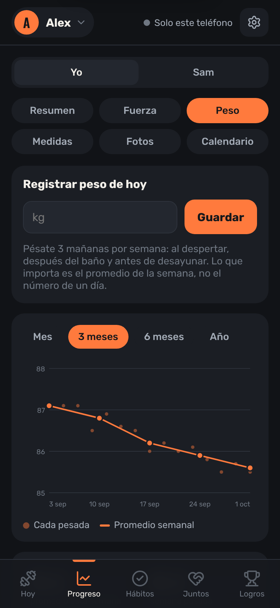
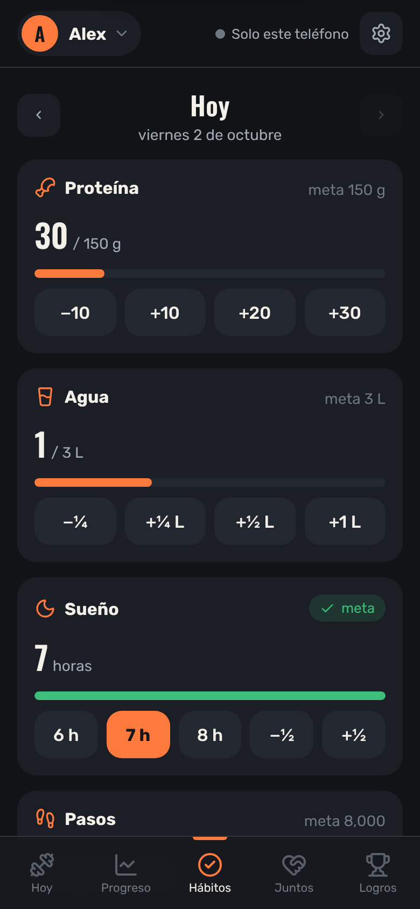
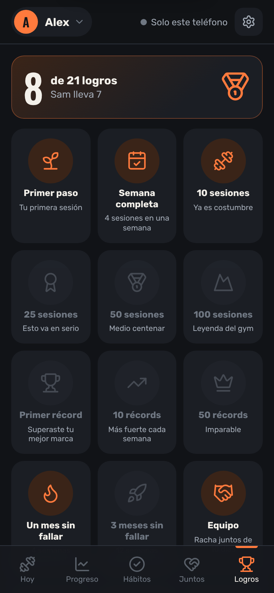
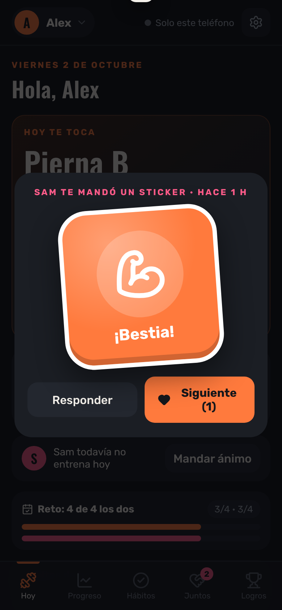

# Chiquis 🏋️💞


**App web instalable (PWA) para entrenar en pareja.** Te dice qué rutina toca hoy, registra cada serie, sugiere cuándo subir peso, detecta récords y estancamientos, y mantiene la motivación con rachas compartidas, retos, stickers y mensajes entre los dos.

Funciona sin internet en el gimnasio y se sincroniza en tiempo real entre ambos teléfonos.

<p>
  
  
  
  
</p>
<p>
  
  
  
  
</p>

> Las capturas usan perfiles y datos de demostración.

---

## Funciones

**Entrenamiento**
- **Hoy te toca:** la rutina sigue una secuencia (Torso A → Pierna A → Torso B → Pierna B); si faltas un día, la semana se recorre sola.
- **Registro por serie** prellenado con lo de la última vez, con botón *"= Igual que la vez pasada"*.
- **Progresión doble automática:** compara cada ejercicio contra la última vez que lo hiciste *en esa misma rutina* (una vez por semana) y sugiere subir peso solo cuando completas todas las series en el tope del rango.
- **Alerta de estancamiento** (3 semanas sin mejorar o 4 con el mismo peso) con recomendaciones.
- **Cambio de ejercicio en el momento** por alternativas equivalentes, y técnica rápida por ejercicio.
- **Detección de récords personales** (peso, repeticiones, asistencia) con celebración.

**Progreso**
- Resumen semanal, gráficas de fuerza (semana, mes, 3 y 6 meses, año; peso máximo o 1RM estimado), peso corporal con promedio semanal y ritmo contra la meta, medidas, fotos de progreso (solo en el teléfono) y calendario de los dos.

**Hábitos** — proteína, agua, sueño y pasos con metas diarias y vista semanal.

**Juntos**
- **Racha juntos:** cuenta los días de entrenamiento en que entrenan los dos; 3 recuperaciones al mes y a la 4ª falta se reinicia.
- Stickers y mensajes, frases que le aparecen al otro al empezar o terminar su sesión, retos de pareja semanales y 21 logros desbloqueables.
- Cada quien decide qué parte de su progreso puede ver el otro.

**Apariencia** — tema claro y oscuro; por defecto sigue el tema del teléfono.

---

## Tecnología

| Parte | Cómo |
|---|---|
| Frontend | JavaScript moderno (módulos ES) sin framework, HTML y CSS. ~2,800 líneas. |
| App instalable | PWA: `manifest.json` + *service worker* con estrategia *network-first* y caché para uso sin internet. |
| Datos | Cloud Firestore con caché persistente (funciona offline y sincroniza al volver la conexión). |
| Autenticación | Firebase Auth con Google; acceso solo para cuentas registradas. |
| Hosting | Firebase Hosting con encabezados de seguridad. |
| Gráficas | SVG generado a mano (sin librerías). |
| Iconos | [Lucide](https://lucide.dev) (ISC), incluidos solo los que se usan en `icons.js`. |
| Pruebas | `node:test` (sin dependencias) + GitHub Actions. |

### Estructura

```
public/
  index.html, styles.css      Interfaz
  app.js                      Arranque, navegación, pantalla Hoy y sesión de entrenamiento
  views.js                    Progreso, Hábitos, Juntos y Logros
  logic.js                    Lógica pura: progresión, récords, rachas, retos, estadísticas
  data.js                     Ejercicios, rutinas, frases, stickers y logros
  store.js                    Almacenamiento: Firestore (nube) o localStorage (modo local)
  sanitize.js                 Validación de todo dato que viene de la base
  ui.js, core.js              Utilidades de interfaz y estado compartido
  icons.js                    Iconos SVG (Lucide)
  sw.js, manifest.json        PWA
  *.example.js                Plantillas de configuración (las reales no se suben)
firestore.rules               Reglas de seguridad de la base de datos
firebase.json                 Hosting + encabezados de seguridad (CSP)
tests/                        Pruebas de la lógica
```

---

## Seguridad

- **Acceso solo para miembros.** Los usuarios permitidos están en la colección `gym_miembros` (que solo se edita desde la consola). Las reglas de Firestore validan la cuenta en el servidor; ningún correo vive en el código.
- **Cada usuario solo modifica lo suyo.** Las reglas verifican el dueño de cada documento; los mensajes recibidos solo pueden marcarse como vistos.
- **Datos validados antes de mostrarse.** `sanitize.js` revisa tipo, rango y formato de cada campo y descarta documentos inválidos; todo texto se escapa antes de insertarse en la página.
- **Content-Security-Policy** que solo permite scripts propios y los de inicio de sesión de Google, más `nosniff`, `Referrer-Policy` y `Permissions-Policy`.
- **Sin secretos en el repositorio:** la configuración de Firebase y los perfiles personales están en `.gitignore`.
- Las fotos de progreso nunca salen del teléfono (IndexedDB).

---

## Correrla localmente

No necesita instalar nada para probarla en modo local (datos solo en el navegador):

```bash
npm run serve       # abre http://localhost:8080
npm test            # pruebas de la lógica
```

## Desplegar tu propia copia

1. Crea un proyecto en [Firebase](https://console.firebase.google.com), activa **Authentication → Google** y crea **Firestore**.
2. Copia `public/firebase-config.example.js` como `public/firebase-config.js` y pega tu configuración.
3. Copia `public/perfiles.example.js` como `public/perfiles.js` y pon nombres, colores y metas.
4. En Firestore crea la colección `gym_miembros` con un documento por persona: **id = correo en minúsculas**, campo `user` = `"a"` o `"b"`.
5. Despliega:
   ```bash
   npm install -g firebase-tools
   firebase login
   firebase use --add
   npm run deploy
   ```

Para actualizar el SDK de Firebase empaquetado: `npm install && npm run build:firebase`.

---

## Licencia

[MIT](LICENSE) © 2026 Carlos Castillo · Iconos de Lucide bajo [licencia ISC](LICENSE-lucide.txt).
